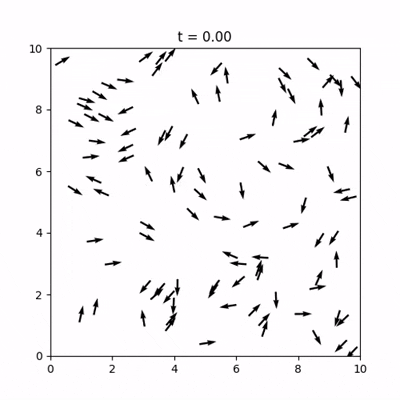
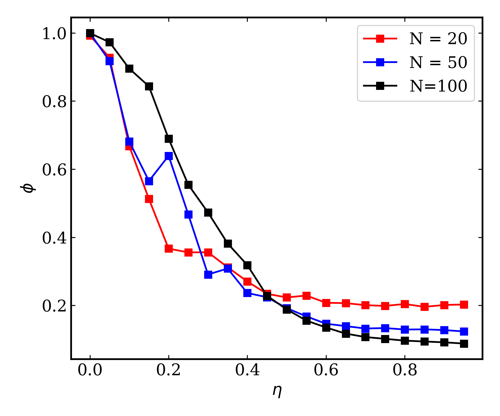

# Vicsek Model Simulation

This repository contains a Python implementation of the **Vicsek model**, a classic agent-based model for collective motion in systems of self-propelled particles. The code simulates the dynamics of particles moving at constant speed, aligning their headings with neighbors within a fixed radius, and subject to angular noise.

## Model Description

The Vicsek model describes $N$ particles moving in a square box of side length $L$ with periodic boundary conditions. Each particle moves with a constant speed $v_0$ and updates its direction of motion at each time step according to the average direction of its neighbors (including itself) plus a random perturbation.

### Parameters

- $N$: number of particles  
- $v_0$: constant speed of each particle  
- $r_0$: interaction radius  
- $\eta$: noise amplitude (in the range $[0, 2\pi)$)  
- $L$: system size  
- $dt$: time step  

### Update Rules

At each time step:

1. **Direction update**: For each particle $i$, find all particles $j$ (including $i$ itself) within distance $r_0$. Compute the average direction of these neighbors:

$$
\langle \hat{n} \rangle = \frac{1}{n_i} \sum_{j \in \text{neighbors}} (\cos\theta_j, \sin\theta_j)
$$

The new orientation is given by:

$$
\theta_i(t+dt) = \arctan2\left(\langle \sin\theta \rangle, \langle \cos\theta \rangle\right) + \eta \cdot \xi_i
$$

where $\xi_i$ is a random number uniformly distributed in $[-\pi, \pi)$.

2. **Position update**: Particles move ballistically with speed $v_0$ in the direction of their new orientation:

$$
\mathbf{r}_i(t+dt) = \mathbf{r}_i(t) + v_0 (\cos\theta_i, \sin\theta_i)\, dt
$$

Periodic boundary conditions are applied after each move.

  

### Order Parameter

The global order parameter (polarization) measures the degree of collective alignment:

$$
\phi = \frac{1}{N} \left| \sum_{i=1}^{N} (\cos\theta_i, \sin\theta_i) \right|
$$

- $\phi = 1$: perfect alignment  
- $\phi \approx 0$: disordered motion  

## Phase Transition

The Vicsek model exhibits a **nonequilibrium phase transition** from a disordered (random) state to an ordered (collective) state as the noise amplitude $\eta$ is reduced below a critical value $\eta_c$.

This transition is continuous and shows characteristic scaling with system size.

For finite systems, the order parameter decays smoothly with increasing noise. In the thermodynamic limit ($N \to \infty$), the transition sharpens, and the critical noise $\eta_c$ can be identified by the crossing of the order parameter curves for different $N$.

The model is widely studied as a paradigmatic example of **flocking** and collective motion in active matter.

  

## Code Structure

The code performs the following steps:

1. **Parameter definition**:
   - $N \in \{20, 50, 100\}$
   - $\eta \in [0, 0.95]$ (step 0.05)
   - $v_0 = 0.2$, $r_0 = 1.0$, $L = 10$, $dt = 0.1$

2. **Simulation loop**:
   - Initialize positions and orientations randomly
   - Evolve the system for 2000 time steps ($200 / 0.1$)
   - Update orientations and positions at each step
   - Compute instantaneous polarization

3. **Steady-state measurement**:
   - Discard first half of the time series
   - Compute average polarization

The final order parameter is plotted as a function of noise for each system size, revealing the phase transition.

## Requirements

- Python 3.6+
- [NumPy](https://numpy.org/) – numerical operations
- [Matplotlib](https://matplotlib.org/) – visualization

## Reference

Vicsek, T., Czirók, A., Ben-Jacob, E., Cohen, I., & Shochet, O. (1995).  
**Novel Type of Phase Transition in a System of Self-Driven Particles**.  
*Nature*, **373**, 1995.  
https://doi.org/10.1038/373361a0